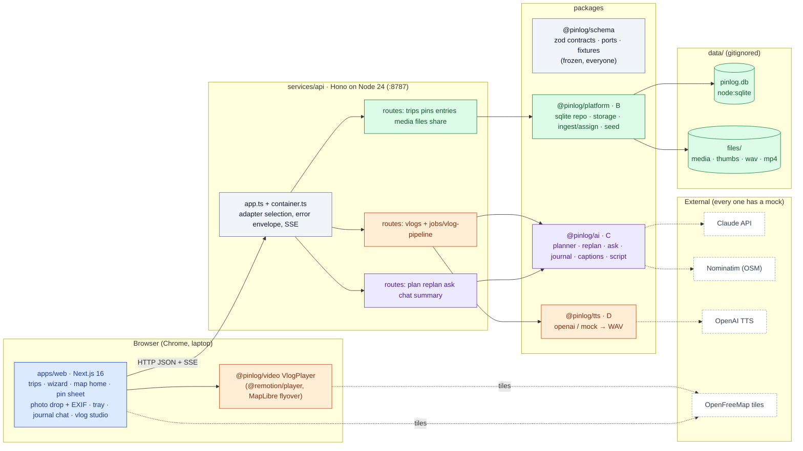
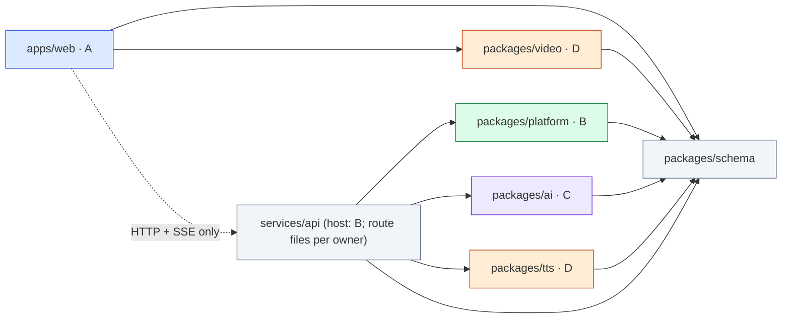
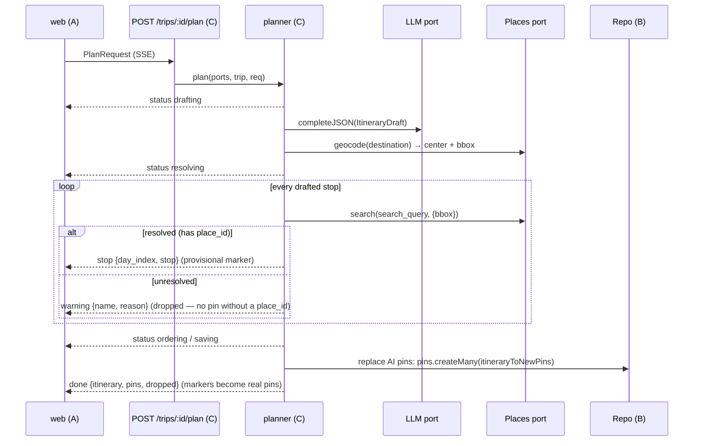

# Pinlog — Architecture

**One idea:** everything is a pin. A trip is an ordered list of pins; planning creates pins, the map fills them
(photos, notes, questions), and the vlog is a pure function of the pins. That single model is what lets four people
build four modules in parallel against one frozen contract (`packages/schema`).

Owners: **A** Client · **B** Platform · **C** AI · **D** Video (see [TEAM.md](TEAM.md)). Colours below follow the owners.

## System (containers)



## Package dependency direction (enforced by `scripts/check-deps.mjs`)



Rules: `schema` depends on `zod` only. Packages export **functions, not HTTP**; route files validate with zod and call
package functions. Nobody imports another owner's package except through this graph. Workspace packages export
TypeScript source (no build step: tsx, Next, Remotion's bundler and vitest all consume `.ts` directly).

## Pipelines

### Plan → pins stream onto the map



### Photo drop → auto-assign (the "it landed on the right pin" moment)

```mermaid
sequenceDiagram
  participant W as web (A)
  participant M as POST /trips/:id/media (B)
  participant I as ingestPhoto (B)
  participant S as Storage
  participant DB as Repo
  W->>W: exifr reads DateTimeOriginal + GPS in the browser → UploadMediaMeta
  W->>M: multipart files[] + meta[]
  M->>I: per file
  I->>I: meta ?? readExif(bytes); thumb (sharp, auto-orient)
  I->>S: put original + thumb (storage keys)
  I->>DB: pins.listByTrip
  I->>I: assignPhoto: within 300 m AND window ±2 h → nearest; else same-day nearest ≤ 300 m; else tray
  I->>DB: media.create (assign_method auto | none)
  M-->>W: UploadMediaResponse {media, results[{pin_id, reason, distance_m}]}
  W->>W: landing HUD + marker pulse, or unsorted tray
```

### One-tap vlog

```mermaid
sequenceDiagram
  participant W as web (A)
  participant V as POST /trips/:id/vlog (D)
  participant J as vlog pipeline (D)
  participant C as generateScript (C)
  participant T as TTS port (D)
  participant S as Storage
  participant PL as VlogPlayer (D)
  W->>V: VlogSettings
  V-->>W: 202 Vlog {status: queued}
  V->>J: runVlogPipeline (in-process, single-flight per trip)
  J->>C: script (timeline → narration grounded ONLY in notes/captions, ≤4 photos/pin, source_entry_ids)
  Note over J: status scripting → tts
  loop pin segments (3 in parallel)
    J->>T: synthesize(narration, voice)
    J->>S: put vlogs/<id>/seg_NN.wav; duration_s = audio + 0.6 s (min 3 s)
  end
  Note over J: status done
  W->>V: GET /vlogs/:id (poll 1.5 s)
  W->>PL: buildRenderProps(script, bundle) → Remotion composition plays in the browser
```

## Ports and adapters (`packages/schema/src/ports`)

| Port | Live adapter (owner) | Mock | Selected by |
|---|---|---|---|
| `Repo` | `@pinlog/platform` sqlite (`node:sqlite`, B) | `createMemoryRepo` (schema) | always sqlite in the API; memory in tests |
| `StorageProvider` | local files under `data/files` (B) | `createMemoryStorage` (schema) | always local in the API |
| `LLMProvider` | Anthropic `claude-opus-5` (C), optional record/replay wrapper | fixture answers by task (C) | `PINLOG_LLM` / `PINLOG_MODE` + `ANTHROPIC_API_KEY` |
| `PlacesProvider` | Nominatim/OSM, 1 req/s, cached (C) | Pittsburgh places (C) | `PINLOG_PLACES` / `PINLOG_MODE` |
| `TTSProvider` | OpenAI `gpt-4o-mini-tts` → WAV (D) | silent WAV of estimated length (D) | `PINLOG_TTS` / `PINLOG_MODE` + `OPENAI_API_KEY` |

`services/api/src/container.ts` picks adapters once at boot. **A live selection whose key is missing falls back to
mock with a warning — the app never crashes for lack of a key.** `GET /health` reports the effective adapters and the
web shows a "Demo mode" badge when everything is mock. Env: `PINLOG_MODE=mock|live`, per-provider overrides
`PINLOG_LLM|PINLOG_PLACES|PINLOG_TTS`, `PINLOG_LLM_REPLAY=off|record|replay` (see `.env.example`).

## Data (SQLite, one file, no migrations framework)

Tables mirror the zod entities: `trips`, `pins`, `media`, `entries`, `messages`, `vlogs`. JSON columns are TEXT parsed
by zod at the repo boundary; `lat`/`lng` are REAL (haversine in code, no PostGIS). Schema change = `pnpm seed:reset`.
Swapping to Supabase later = a new `Repo` + `StorageProvider` implementation; nothing else changes.

## Runtime layout

| Process | Port | Command | Notes |
|---|---|---|---|
| API | 8787 | `pnpm dev:api` | `tsx watch`, reads `.env` at the repo root |
| Web | 3000 | `pnpm dev:web` | Next dev; talks to the API origin directly (no rewrite → SSE streams cleanly) |
| Remotion Studio | 3100 | `pnpm studio` | D only; `publicDir = data/files` so `pnpm seed` first |
| Render (stretch) | — | `pnpm render -- --vlog <id>` | local `remotion render`, static map mode by default |

## Gotchas (designed around; do not undo)

| # | Gotcha | Mitigation |
|---|---|---|
| 1 | Two React copies → "Invalid hook call" in the Player | one version via `catalog:` + `overrides`; `packages/video` declares React as a peer; web imports `VlogPlayer` from `@pinlog/video`, never `@remotion/player` directly. `pnpm why react` must show one version |
| 2 | MapLibre / Player touch `window` during SSR | client components, loaded with `next/dynamic({ ssr: false })` |
| 3 | MapLibre inside Remotion is non-deterministic | ONE persistent map, `interactive:false`, `fadeDuration:0`, camera from `useCurrentFrame()` via `jumpTo` (never `flyTo`), `delayRender` until `idle` only when rendering; `map_mode: 'static'` SVG route card for MP4 renders |
| 4 | Remotion Studio defaults to port 3000 | `Config.setStudioPort(3100)` |
| 5 | `node:sqlite` is marked experimental | verified silent on Node 24.18; `engines.node >= 24`, `.node-version` |
| 6 | exifr revives dates in the browser's timezone | `reviveValues: false` + `fromExifDate`; times are naive trip-local strings everywhere; never `toISOString()` a taken-at |
| 7 | iPhone HEIC: Chrome cannot show it, prebuilt sharp cannot decode it | EXIF is still read; placeholder thumb; demo phone set to "Most Compatible" (JPEG) and AirDrop keeps GPS |
| 8 | 20 × 5 MB uploads | browser → API directly, batches of 4, `bodyLimit` 50 MB |
| 9 | Tailwind 4 | `@tailwindcss/postcss` + `@import "tailwindcss"`; not used in `packages/video` (inline styles) |
| 10 | TypeScript 7 (native) is `latest` | pinned 5.9.3 |
| 11 | ESM everywhere | `"type": "module"`, `import.meta.dirname`, never run `node file.ts` directly (use tsx) |
| 12 | Nominatim policy | 1 req/s serial queue, identifying User-Agent (`NOMINATIM_EMAIL`), in-process cache; keep the OSM attribution on the map and in the vlog outro |
| 13 | SSE from a POST | `fetch` + `parseSSE` (schema) with an `AbortController`; `EventSource` is GET-only |
| 14 | Background job in a dev server | in-process promise with statuses + polling; single-flight per trip; a failure lands in `vlogs.error`, never a crash |
| 15 | maplibre-gl 6 spawns its **module web worker** from a URL relative to its own chunk; under Next/Turbopack that is a 404 HTML page → the worker dies silently: no tiles, no `load` event (so fit-on-load never runs), only a "Failed to load module script" console error | the app serves `maplibre-gl-worker.mjs` + `maplibre-gl-shared.mjs` from the installed package at `/maplibre/[file]` (`apps/web/src/app/maplibre/[file]/route.ts`) and calls `setWorkerUrl()` before any map is created (`apps/web/src/lib/maplibre.ts`, imported by `TripMap` and by the Player loader). Remotion Studio (webpack) does not need it |
