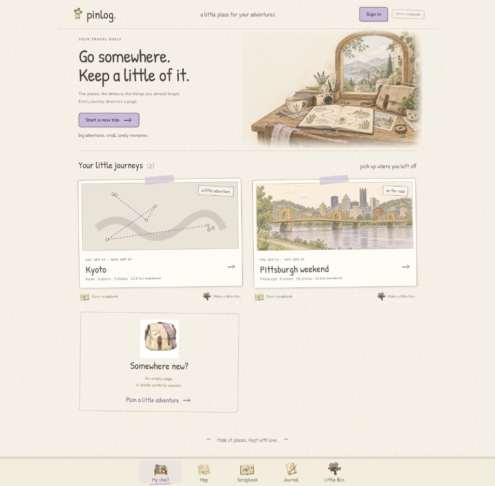
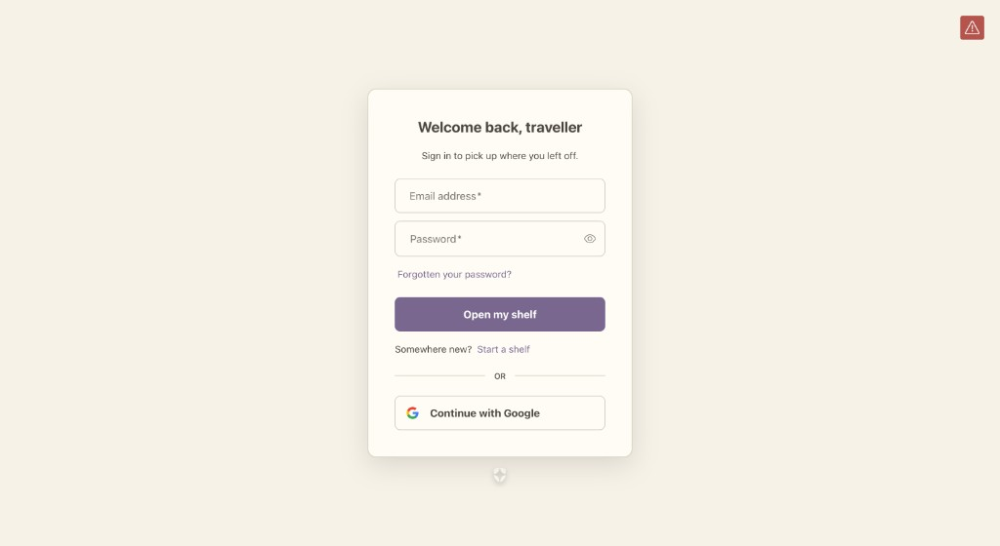
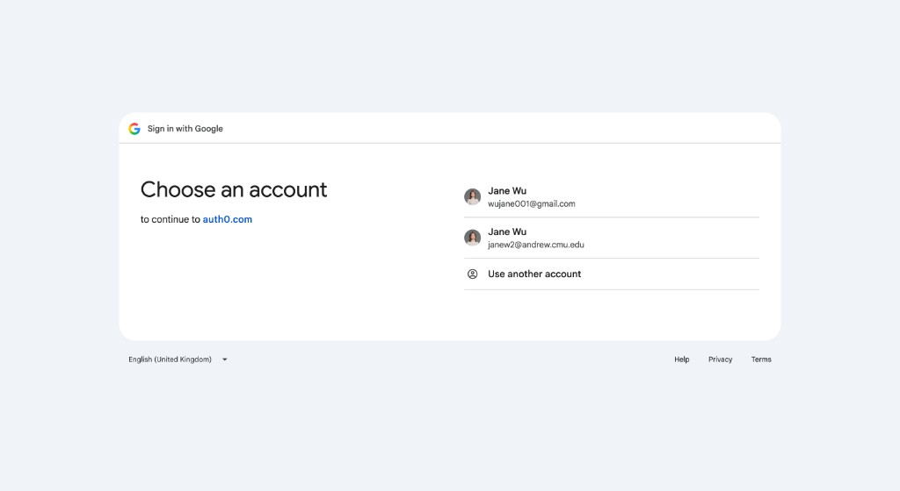
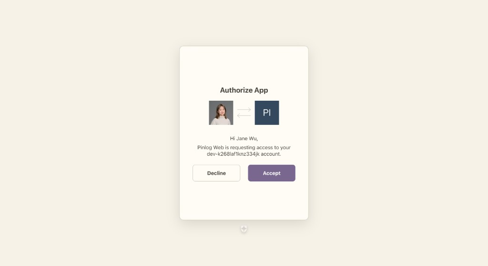
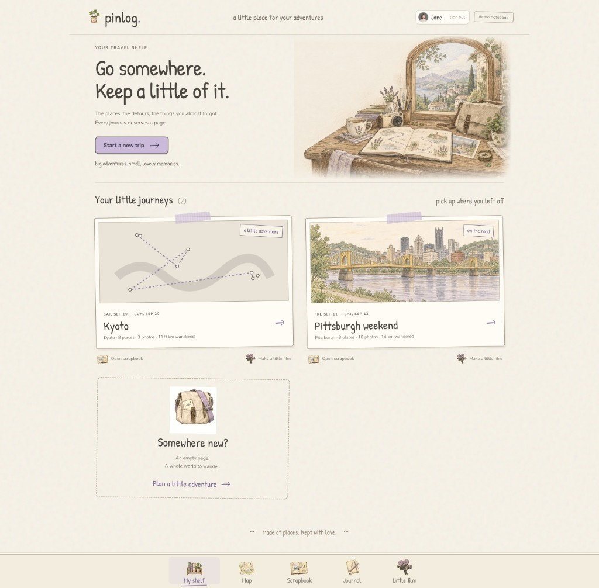

# Pinlog × Auth0 — who you are, before you keep a place

*HackCMU 2026 · Best Use of Auth0 · a map-first travel diary*

A trip is personal. The photos, the notes, the little film at the end — that is a diary, not a public feed. Pinlog needed a way to know **who is holding the notebook** without ever touching a password, and without building an identity system in twenty-four hours.

**Auth0 is that way in.** Universal Login, Google as a first-class connection, a branded page that already looks like Pinlog, and a session cookie the server can trust. The rest of the app — pins, EXIF landing, the vlog — never sees a credential.

This is the flow a judge walks, captured from the running app.

---

## The story in five screens

### 1. The shelf, unsigned



The travel shelf is public on purpose: a shared Pittsburgh weekend still opens. What you **cannot** do without signing in is start a new trip. The header carries a single **Sign in** chip — `/auth/login` — and that is the whole client. No form, no password field, no Auth0 SDK in the browser beyond `useUser()`.

### 2. Universal Login, in Pinlog's voice



The browser leaves Pinlog for Auth0. The page is not stock Auth0 blue: paper background, cream widget, `#796790` button, copy that belongs in the notebook — *Welcome back, traveller* / *Open my shelf* / *Somewhere new? Start a shelf*.

That theme is not a dashboard click-through. It lives in `scripts/auth0-branding.mjs` and reapplies with `pnpm auth0:brand`, so a teammate's tenant gets the same page. Contrast is checked before write (button label 5.05:1, body 9.44:1, placeholders 4.65:1 — all WCAG AA).

Passwords, if anyone types one, never hit our origin. Google is one tap below.

### 3. Continue with Google



A social connection on the same Universal Login. Auth0 brokers the Google OAuth; Pinlog only asked for `openid profile email`. The traveller picks the account they already have — Andrew or Gmail — and we never store a Google refresh token.

### 4. Consent, once



First time through, Auth0 asks the human to let **Pinlog Web** see the profile. After **Accept**, Auth0 redirects to `http://localhost:3000/auth/callback` with an authorization code. The Next.js server exchanges it (authorization code + PKCE). The browser never holds the client secret.

### 5. Back on the shelf, as Jane



The chip is now the Google avatar, the first name, and **sign out**. `/profile` reads the same session server-side and shows the Auth0 `sub`, the connection, and whether the email is verified. Starting a new trip is unlocked.

Sign out is `/auth/logout` — Auth0 clears its session and ours in one hop.

---

## Why this is the right Auth0, not a pasted widget

| What judges see | What Auth0 is doing |
|---|---|
| The login page looks like Pinlog | Universal Login **theme + custom text**, committed and re-runnable |
| Google on the same screen | A social **connection**, not a second login we built |
| Sign in from a Next.js App Router app | **Regular Web Application** — confidential client, code + PKCE |
| Header never flashes the wrong state | `getSession()` on the server seeds `<Auth0Provider>` |
| New trip is locked; a shared trip is not | Next 16 **proxy** checks the session only on `/trips/new` and `/profile` |
| A teammate can reproduce the tenant | `pnpm auth0:setup` + `pnpm auth0:brand` |

We did **not** put a login form in React. We did **not** store users in SQLite. Identity is Auth0's job; Pinlog's job is the pins.

---

## How it is wired (short)

**SDK.** `@auth0/nextjs-auth0` v4 on Next.js 16. The client is a Regular Web Application (`AUTH0_CLIENT_SECRET` lives only on the server). v4 mounts `/auth/login`, `/auth/callback`, `/auth/logout`, `/auth/profile` — no `/api` prefix.

**Session.** Encrypted cookie, keyed by `AUTH0_SECRET`. `apps/web/src/lib/auth0.ts` builds `Auth0Client` on first use so `next build` does not need credentials, and **throws** if a variable is missing. There is no guest fallback: a judge cannot click past login.

**Guard.** `apps/web/src/proxy.ts` always runs `auth0().middleware(request)` so the cookie refreshes. Protected paths redirect to `/auth/login?returnTo=…`. Reading `/` and `/trips/[id]` stays open so the Pittsburgh demo and a shared vlog still work cold.

**Who you are, on the page.** Client: `useUser()` in `UserChip`. Server: `auth0().getSession()` in the root layout and on `/profile`. The profile page never trusts the browser — only the cookie.

**Scope.** `openid profile email`. Enough for a name, a picture, and an email. No Management API from the app at runtime; CLI scripts talk to the tenant only at setup.

```
browser  →  /auth/login
         →  Auth0 Universal Login  (database and/or Google)
         →  /auth/callback  (code)
         →  Next.js server exchanges code  (client secret stays here)
         →  encrypted session cookie
         →  shelf, with Jane in the header
```

---

## What we would tell Auth0 at the table

Pinlog is a diary that becomes a film. The prize-shaped question is: *can you start a trip as yourself, with an identity system we did not have to invent?*

Yes. Universal Login is the front door, Google is how people actually sign in at a hackathon, the page is branded so the story never leaves the notebook, and the session is a cookie the server checks before anyone plans a new page of it.

The deeper increment — trips owned per `sub` — is a contract change we parked so the other three owners could keep shipping. Sign-in already proves **who you are**. Partitioning **what you see** is the obvious next Auth0-shaped line.

---

## Reproduce in five minutes

```bash
brew install auth0 && auth0 login
pnpm auth0:setup      # Regular Web App + apps/web/.env.local
pnpm auth0:brand      # Pinlog theme + copy
pnpm dev              # http://localhost:3000 → Sign in
```

Engineering notes (callbacks, phone demo, failure modes): [AUTH.md](AUTH.md).
