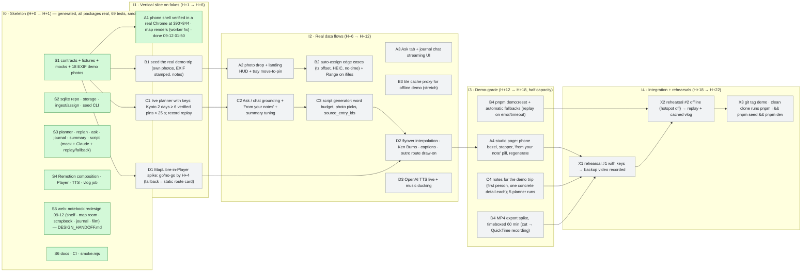

# 24-hour plan — iteration board, readiness board, cut list

**This is the only status artifact.** Owners update their own nodes the moment a status changes (one-line commit:
`docs: A2 done H+9`). D reconciles at every checkpoint. If it is not on this board, it is not in the demo.

Legend: `todo` grey · `wip` yellow · `done` green · `blocked` red · `cut` dashed. Node id = owner letter + number.

## Iteration board

### What the generated skeleton does NOT do yet (honest list, H+1)
- No music track (`music_url` is always null; VLOG-4 "music optional").
- MP4 export CLI (`pnpm render`) is written but has not been run here (needs Remotion's headless Chrome download) — D4.
- Drag a photo **onto a marker** is not built; the tray's "Move to pin" picker is (cut-list #5 already taken).
- Drag-to-reorder pins is not built; delete / add manual pin / change time are (PLAN-3 in-lite).
- Live planner + live TTS have been exercised only through the mocks; first real-key run is C1 / D3.
- ~~Basemap tiles and the live MapLibre flyover could not be verified headless~~ → they never rendered in *any* browser because MapLibre's web worker 404'd under Turbopack (docs/ARCHITECTURE.md gotcha 15). Fixed 09-12 01:40; map tiles, the pin sheet, journal, tray and the live flyover inside the Player were then verified in a real Chrome at 390×844 (A1). Not yet verified on a physical phone (see HANDOFF.md step 3).

## Demo readiness board (one node per beat of [DEMO.md](DEMO.md); A updates after each rehearsal)

```mermaid
flowchart LR
  classDef ok fill:#d3f9d8,stroke:#2b8a3e
  classDef flaky fill:#fff3bf,stroke:#e67700
  classDef broken fill:#ffe3e3,stroke:#c92a2a
  classDef todo fill:#f1f3f5,stroke:#868e96

  R1["1 open on the Pittsburgh map"]:::ok --> R2["2 Kyoto plan streams pins"]:::todo --> R3["3 pin sheet: photos, note, why"]:::ok
  R3 --> R4["4 live photo lands on the CMU pin"]:::todo --> R5["5 no-GPS photo → tray → move"]:::todo --> R6["6 Summarize my day"]:::flaky
  R6 --> R7["7 Make vlog → stepper"]:::todo --> R8["8 Player: flyover + narration + note pill"]:::flaky --> R9["9 outro + architecture slide"]:::todo
```

Rule: a beat that is red at H+22 is removed from the script, not fixed on stage.

_09-12 01:50: green = walked in a real Chrome (phone viewport, mock providers); yellow = renders but only exercised with mock answers / not yet on a physical phone or with keys._

## Cut order when behind (first cut → last cut)
1. MP4 export via `remotion render` → screen-record the Player (QuickTime).
2. Vision captions on ingest → fixture/hand-written captions only.
3. Replan (PLAN-4).
4. Drag-to-reorder pins → delete + add manual only.
5. Drag photo onto a marker → "Move to pin" picker only.
6. "Create pin from photo" in the tray.
7. Pin-level Ask → keep only the trip-level journal chat (same judging value).
8. Music ducking → constant low music, or no music.
9. Share page.
10. Live planner → replay only (looks identical on stage).
11. Live TTS → cached TTS for the seeded trip, silent + captions elsewhere.
12. Outro route draw-on → static route.

**Never cut:** map with pins · photo drop + auto-assign + tray · vlog in the Player with flyover + narration · streaming plan (live or replay) · "Summarize my day".

## PRD requirement matrix for 24 h

| ID | Status | 24 h acceptance |
|---|---|---|
| PLAN-1 create trip | **In** | destination, dates, party, interests, pace, budget in ≤ 5 taps |
| PLAN-2 AI itinerary | **In (modified)** | pins stream in; every pin verified against OSM inside the destination bbox; unresolved dropped with a visible count; ≥ 3/day; no opening hours |
| PLAN-3 edit itinerary | In-lite | delete, add manual pin, change time; reorder = stretch |
| PLAN-4 NL replan | Stretch | diff applied; user pins locked |
| PLAN-5 route lines + travel time | In (route) / fake (time) | route line per day; "~min walk" label if time |
| PLAN-6 import pasted itinerary | Out | |
| MAP-1 map-first home | **In** | day chips, route, "now" marker |
| MAP-2 pin sheet | **In** | Info / Photos / Notes / Ask |
| MAP-3 Ask | In-lite | streamed, grounded in pin + trip + notes, **no tools**, history saved |
| MAP-4 photo upload + auto-assign | **In** | EXIF in browser; 300 m / ±2 h; landing HUD |
| MAP-5 unsorted tray | **In** | tray + move-to-pin; create-pin-from-photo = stretch |
| MAP-6 quick note | **In** | text + mood |
| MAP-7 timeline | Out (list view = stretch) | |
| MAP-8/9/10 | Out | |
| VLOG-1 one-tap generate | **In (modified)** | in-page stepper instead of push |
| VLOG-2 AI script | **In** | ≤ 4 photos/pin, ≤ 2 sentences, grounded, `source_entry_ids` |
| VLOG-3 visuals | **In** | 1080×1920 @ 30 fps in the Player; MP4 file = stretch |
| VLOG-4 TTS + music | In-lite | one voice, English; music optional |
| VLOG-5 regenerate | Stretch | instructions passed to the script generator |
| VLOG-6 edit script | Out | |
| VLOG-7 export / share page | Stretch / Out | |
| VLOG-8 templates | Out | |
| X-1 auth · X-2 privacy · X-3 i18n · X-4 analytics | Out | parked in [DECISIONS.md](DECISIONS.md) |
| Journal chat + "summarize my day" (meeting notes) | **In** | trip-level chat grounded in notes |
